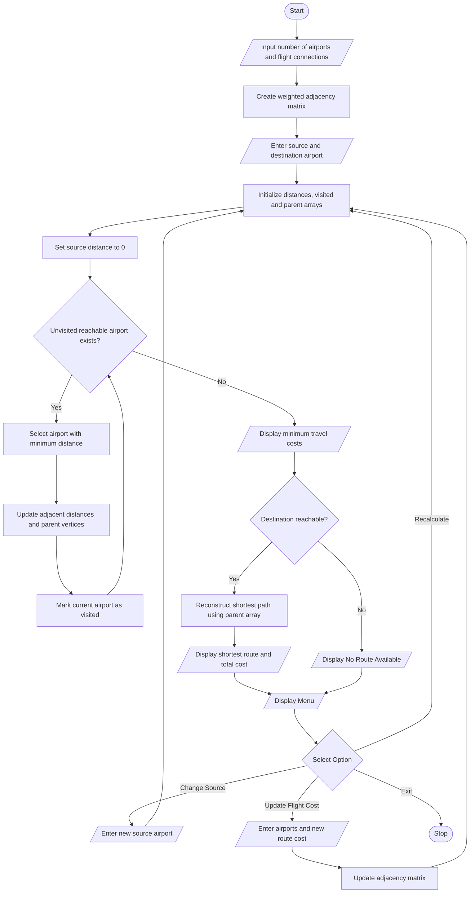

## Flowchart

```mermaid
flowchart TD
    A([Start]) --> B[/Input number of airports and flight connections/]
    B --> C[Create weighted adjacency matrix]
    C --> D[/Enter source and destination airport/]
    D --> E[Initialize distances, visited and parent arrays]
    E --> F[Set source distance to 0]
    F --> G{Unvisited reachable airport exists?}

    G -- Yes --> H[Select airport with minimum distance]
    H --> I[Update adjacent distances and parent vertices]
    I --> J[Mark current airport as visited]
    J --> G

    G -- No --> K[/Display minimum travel costs/]
    K --> L{Destination reachable?}

    L -- Yes --> M[Reconstruct shortest path using parent array]
    M --> N[/Display shortest route and total cost/]

    L -- No --> O[/Display No Route Available/]

    N --> P[/Display Menu/]
    O --> P

    P --> Q{Select Option}

    Q -- Change Source --> R[/Enter new source airport/]
    R --> E

    Q -- Update Flight Cost --> S[/Enter airports and new route cost/]
    S --> T[Update adjacency matrix]
    T --> E

    Q -- Recalculate --> E

    Q -- Exit --> U([Stop])
```
