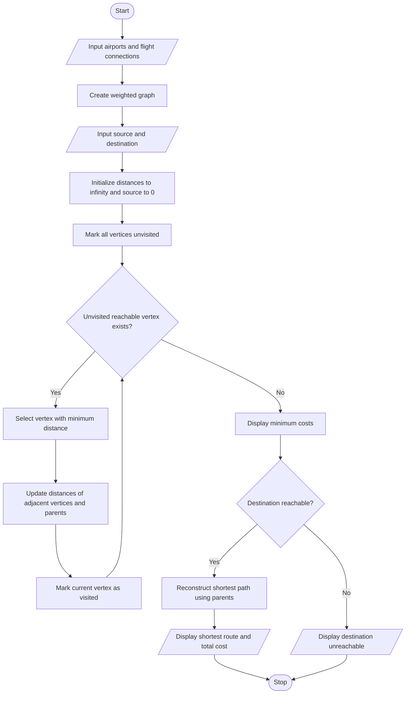

## Flowchart

```mermaid
flowchart TD
    A([Start]) --> B[/Input airports and flight connections/]
    B --> C[Create weighted graph]
    C --> D[/Input source and destination/]
    D --> E[Initialize distances to infinity and source to 0]
    E --> F[Mark all vertices unvisited]
    F --> G{Unvisited reachable vertex exists?}
    G -- Yes --> H[Select vertex with minimum distance]
    H --> I[Update distances of adjacent vertices and parents]
    I --> J[Mark current vertex as visited]
    J --> G
    G -- No --> K[Display minimum costs]
    K --> L{Destination reachable?}
    L -- Yes --> M[Reconstruct shortest path using parents]
    M --> N[/Display shortest route and total cost/]
    L -- No --> O[/Display destination unreachable/]
    N --> P([Stop])
    O --> P
```
