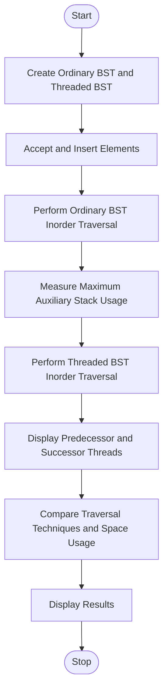

## Flowchart

```mermaid
flowchart TD
    A([Start]) --> B[Create Ordinary BST and Threaded BST]
    B --> C[Accept and Insert Elements]
    C --> D[Perform Ordinary BST Inorder Traversal]
    D --> E[Measure Maximum Auxiliary Stack Usage]
    E --> F[Perform Threaded BST Inorder Traversal]
    F --> G[Display Predecessor and Successor Threads]
    G --> H[Compare Traversal Techniques and Space Usage]
    H --> I[Display Results]
    I --> J([Stop])
```
