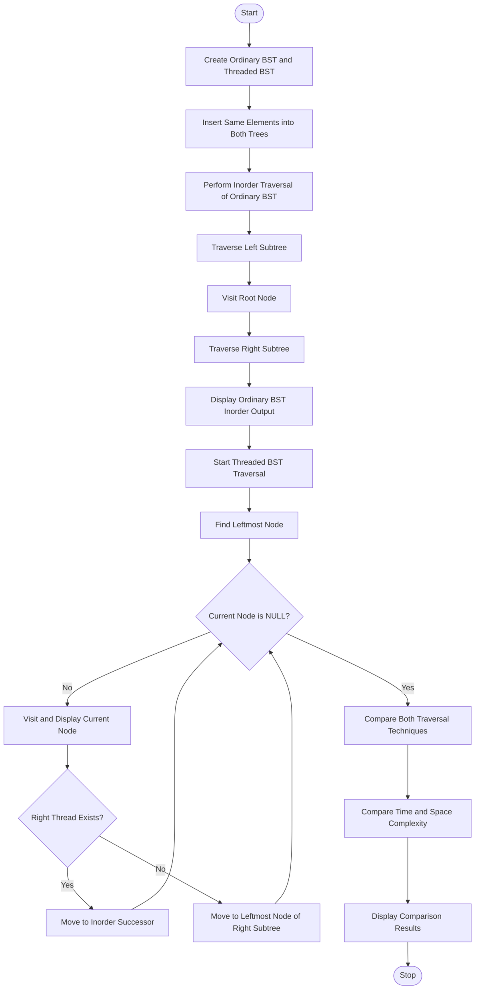

## Flowchart

```mermaid
flowchart TD
    A([Start]) --> B[Create Ordinary BST and Threaded BST]
    B --> C[Insert Same Elements into Both Trees]
    C --> D[Perform Inorder Traversal of Ordinary BST]

    D --> E[Traverse Left Subtree]
    E --> F[Visit Root Node]
    F --> G[Traverse Right Subtree]
    G --> H[Display Ordinary BST Inorder Output]

    H --> I[Start Threaded BST Traversal]
    I --> J[Find Leftmost Node]
    J --> K{Current Node is NULL?}

    K -- No --> L[Visit and Display Current Node]
    L --> M{Right Thread Exists?}

    M -- Yes --> N[Move to Inorder Successor]
    M -- No --> O[Move to Leftmost Node of Right Subtree]

    N --> K
    O --> K

    K -- Yes --> P[Compare Both Traversal Techniques]
    P --> Q[Compare Time and Space Complexity]
    Q --> R[Display Comparison Results]
    R --> S([Stop])
```
