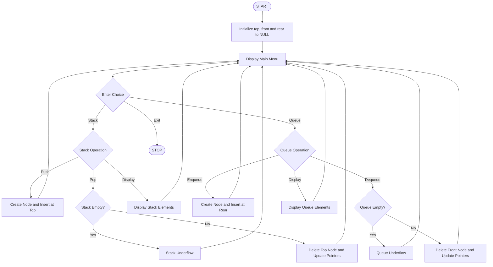

## Flowchart: Stack and Queue Using Doubly Linked List

```mermaid
flowchart TD
    A([START]) --> B["Initialize top, front and rear to NULL"]
    B --> C["Display Main Menu"]
    C --> D{"Enter Choice"}

    D -->|Stack| E{"Stack Operation"}
    D -->|Queue| F{"Queue Operation"}
    D -->|Exit| Z([STOP])

    E -->|Push| G["Create Node and Insert at Top"]
    E -->|Pop| H{"Stack Empty?"}
    E -->|Display| I["Display Stack Elements"]

    H -->|Yes| J["Stack Underflow"]
    H -->|No| K["Delete Top Node and Update Pointers"]

    F -->|Enqueue| L["Create Node and Insert at Rear"]
    F -->|Dequeue| M{"Queue Empty?"}
    F -->|Display| N["Display Queue Elements"]

    M -->|Yes| O["Queue Underflow"]
    M -->|No| P["Delete Front Node and Update Pointers"]

    G --> C
    I --> C
    J --> C
    K --> C
    L --> C
    N --> C
    O --> C
    P --> C
```
