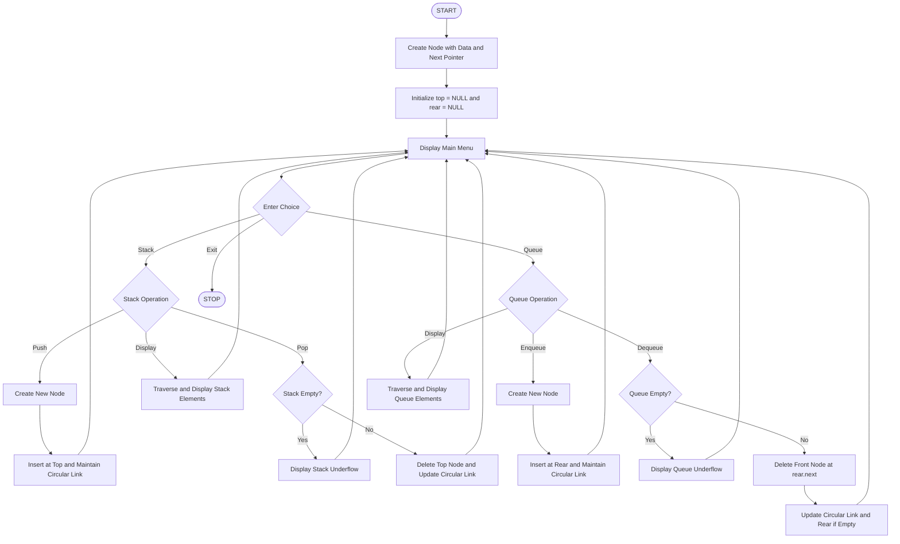

## Flowchart: Stack and Queue Using Circular Linked List

```mermaid
flowchart TD
    A([START]) --> B["Create Node with Data and Next Pointer"]
    B --> C["Initialize top = NULL and rear = NULL"]
    C --> D["Display Main Menu"]
    D --> E{"Enter Choice"}

    E -->|Stack| F{"Stack Operation"}
    E -->|Queue| G{"Queue Operation"}
    E -->|Exit| Z([STOP])

    F -->|Push| H["Create New Node"]
    H --> I["Insert at Top and Maintain Circular Link"]
    I --> D

    F -->|Pop| J{"Stack Empty?"}
    J -->|Yes| K["Display Stack Underflow"]
    J -->|No| L["Delete Top Node and Update Circular Link"]
    K --> D
    L --> D

    F -->|Display| M["Traverse and Display Stack Elements"]
    M --> D

    G -->|Enqueue| N["Create New Node"]
    N --> O["Insert at Rear and Maintain Circular Link"]
    O --> D

    G -->|Dequeue| P{"Queue Empty?"}
    P -->|Yes| Q["Display Queue Underflow"]
    P -->|No| R["Delete Front Node at rear.next"]
    R --> S["Update Circular Link and Rear if Empty"]
    Q --> D
    S --> D

    G -->|Display| T["Traverse and Display Queue Elements"]
    T --> D
```
